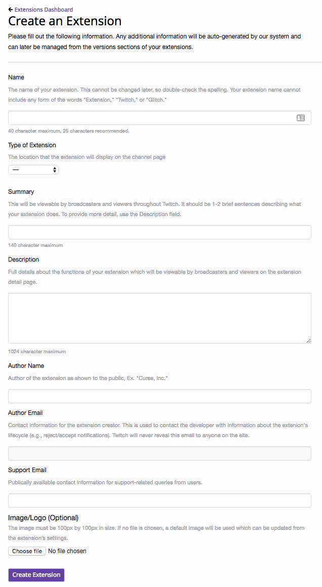
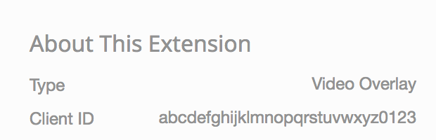
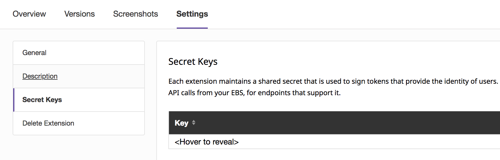
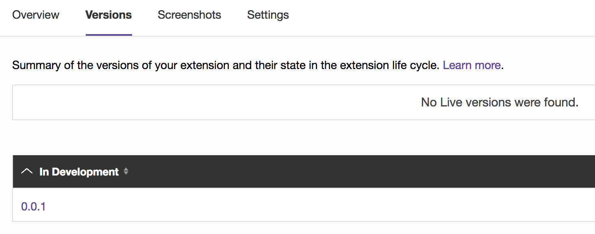
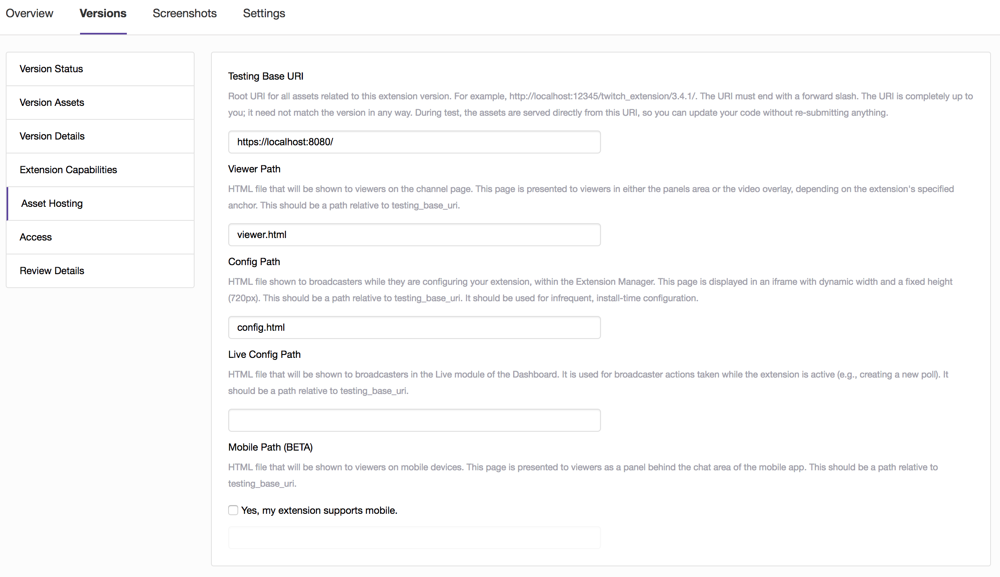

# Twitch Extensions Developer Rig
[](https://travis-ci.org/twitchdev/developer-rig) [](https://coveralls.io/github/twitchdev/developer-rig)
## Twitch Extensions 101
Think of Twitch Extensions as Apps for Twitch. Developers can create sandboxed web applications that run on [Twitch](https://twitch.tv) that provide new and different ways for viewers and broadcasters to interact.

To build the simplest Extension, a developer creates a web application; a collection of assets that include HTML, CSS, and Javascript; and then hosts these assets from the Twitch CDN ext.twitch.tv. A more complicated, but more common, Extension, leverages an Extension Backend Service (EBS). An EBS is a web service written by a developer for managing the state of their Extension. These two blocks of developer written code are often referred to as the **frontend** and the **backend**.

_Developer's are currently completely responsible for operating their backends._

The [Twitch Developer Site](https://dev.twitch.tv) is currently where the lifecycle of an Extension is managed. This includes creation, _frontend_ asset upload, submitting to review, and promoting to be released. The Dev Site is where key pieces of data are retrieved to configure and run the Developer Rig.

The Developer Rig hosts Extension frontends locally. This gives developers complete flexibility to run and test their Extensions without needing to load Twitch. For example, the Developer Rig does not currently stream video, reducing friction for testing a Video Overlay Extension. Additionally, multiple views of a single Extension can be loaded onto a single page, giving developers a single pane of glass for the different relevant views for their Extension.

## Motivation
The Developer Rig is a tool that enables [Twitch Extensions](https://dev.twitch.tv/extensions) developers to iterate more quickly and focus on building great Extensions, by providing a single pane of glass for all end user Extensions views and interactions. It is a lightweight web app that runs in a browser and is built using [NodeJS 6+](https://nodejs.org) and [React](https://reactjs.org/). The Developer Rig allows Extensions Developers to quickly and easily, locally end-to-end test in development Extensions.

## Quick Links
* [Overview](#overview)
* [Getting Started](#getting-started)
  * [Requirements](#requirements)
  * [Configuring the Developer Rig](#configuring-the-developer-rig)
  * [Starting the Developer Rig](#starting-the-developer-rig)
  * [Using the Developer Rig](#using-the-developer-rig)
* [Loading a Sample Extension](#loading-a-sample-extension)
* [TL;DR](#tldr)
* [FAQs](#faqs)
* [Troubleshooting](#troubleshooting)

## Overview
The Developer Rig renders Extensions in a combination of user contexts, views and different anchor types.

Supported user contexts include:
* broadcaster
* logged in viewers (linked and unlinked)
* logged out viewers (i.e. anonymous users)

Supported views include:
* channel page
* live dashboard
* broadcaster configuration

Supported anchor types include:
* panels
* video overlays
* mobile and video components (coming soon)

Extension output logs can be redirected to the [Rig Console](#rig-console), a Developer Rig specific local console.

## Getting Started
[Clone this repository!](https://github.com/twitchdev/developer-rig)

### Requirements
This project requires `yarn` and `NodeJS`. Both must be installed to use the Developer Rig.

#### Installing Dependencies
To install `Node.js`, [follow the instructions here](https://nodejs.org/en/download/current/). By default, this installs the NPM package manager (`npm`), however, in all of our documentation we reference the use of Yarn which you can install by [following the instructions here](https://yarnpkg.com/lang/en/docs/install).

Once you have Yarn installed, simply run the command `yarn install` from the root of the cloned repository to fetch all the dependencies need to run the Developer Rig.
```bash
yarn install
```

#### Create an Extension on the Twitch Dev Site
For each Extension to be tested in the Developer Rig, a corresponding Extension needs to be created on the [Twitch Dev Site](https://dev.twitch.tv/dashboard). More detailed instructions to do this can be found [here](https://dev.twitch.tv/docs/extensions#creating-your-extension). Most fields are not relevant for the Developer Rig. The _Type of Extension_ is loaded into the Developer Rig, and is hence important. Similarly, the _Author Email_ must be correctly set and verified, before an [Extension secret](#developer-rig-configuration) can be created.



There are several highly pertinent pieces of data that need to be taken from the dev site, and surfaced in the Developer Rig for it to operate. These include:
* The Client ID of the Extension
* The version of the Extension to be loaded in the Developer Rig
* A generated Extension Secret, to be used to sign Extension JWTs

These are hard requirements that enable the Developer Rig to function correctly!

### Configuring the Developer Rig
Where possible, the Developer Rig is self-contained.

#### Host File
To allow non-Twitch hosted assets to not be blocked by the Extension's [Content Security Policy](https://dev.twitch.tv/docs/extensions/guide#appendix-b-guidelines-and-policies) (CSP), the Developer Rig requires a local host file entry.

The following line must be added to your local hosts file:
```bash
127.0.0.1 localhost.rig.twitch.tv
```

On Unix based systems run the command:
```bash
echo '127.0.0.1 localhost.rig.twitch.tv' | sudo tee -a /etc/hosts
```

On Windows machines:
```
1. Press the Windows key.
2. Type Notepad in the search field.
3. In the search results, right-click Notepad and select Run as administrator.
4. From Notepad, open the following file: c:\Windows\System32\Drivers\etc\hosts.
5. Add the line: 127.0.0.1 localhost.rig.twitch.tv
6. Click File > Save to save your changes.
```

This is a *one time setup* and is required to run the Developer Rig.

#### Developer Rig Configuration
If you are new to building Twitch Extensions, [read this first](https://dev.twitch.tv/docs/extensions#high-level-steps-for-developing-extensions).

There are several pieces of configuration that the Developer Rig requires to function correctly:

* Client ID: the unique identifier for your Extension. Go to the [Extensions Dashboard](https://dev.twitch.tv/dashboard/extensions), select the Extension you want to run in the Developer Rig, then look for `Client ID` under `About This Extension`.

  

* Extension Secret: a valid secret, that allows your Extension to authenticate. Go to the [Extensions Dashboard](https://dev.twitch.tv/dashboard/extensions), select the Extension you want to run in the Developer Rig, select the `settings` tab, and then navigate to `Secret Keys` and create/retrieve a valid secret.

  

  This is **not** the *Client Secret* field located on the *General* tab under settings. Please ensure to go to **Secret Keys**.

* Version: the exact version of an Extension to be loaded in the Developer Rig. Go to the [Extensions Dashboard](https://dev.twitch.tv/dashboard/extensions), find the Extension you want to run in the Developer Rig, and take note of the version number displayed under `status`.

  

* Channel: the name of the channel to be used for Twitch PubSub messaging. A channel is a string of less than 32 alphanumeric characters. We recommend prefixing your channel with `rig`. If you later want to change the name of your channel you must delete or edit your browser's local storage as well as changing your EXT_CHANNEL argument.

* Owner name: the Twitch user name of the owner of the Extension (the Twitch user who created the Extension).

Values for these fields need to be injected as environment variables to the Developer Rig at startup. The environment variables names are:
* `EXT_CLIENT_ID`
* `EXT_SECRET`
* `EXT_VERSION`
* `EXT_CHANNEL`
* `EXT_OWNER_NAME`

If you don't want to set these values via environment variables, all but the extension secret can be set through a configuration file. This file is specified via a command line argument and is in the format of
```javascript
{
  "clientID": "<client id>",
  "version": "<version>",
  "channel": "<channel>",
  "ownerName": "<owner>"
}
```

### Starting the Developer Rig
Ensure that the [Developer Rig dependencies](#installing-dependencies) are installed and [required configuration](#developer-rig-configuration) is available.

To start the rig with environment variables, run:
```bash
EXT_CLIENT_ID=<client id> EXT_SECRET=<secret> EXT_VERSION=<version> EXT_CHANNEL=<channel> EXT_OWNER_NAME=<owner> yarn start
```
To start the rig with a config file and command line arguments, run:
```bash
yarn start -s <secret> -c location/of/your/config
```
The location of your config file can be either relative to the directory you are running the command or an absolute path to the file.

This will cause your browser to open to `https://localhost.rig.twitch.tv:3000`.

*Note*: Depending on your browser and operating system, you may see a warning that the TLS certificate is illegitimate as it is self-signed. You can choose to proceed through this warning (or just use [Chrome](https://www.google.com/chrome/)). TLS certificate generation occurs the first time the Developer Rig is started or it is used to host a sample extension. Generated certificates are stored in the `ssl` directory. If you are on OSX, we'll generate and install the certs in the keychain. If you are on Windows or Linux, you'll have to configure that yourself.


### Using the Developer Rig
The Developer Rig UI presents a variety of views, anchors, and contexts.

#### Extension Views
This is likely the most used area for the Developer Rig. Views, anchors, and contexts can be configured to support comprehensive testing of an Extension.

Click the `plus` button to add a new view for the configured Extension Client ID, and remove them by clicking on the `x` on a view.

#### Broadcaster Config
This section displays the Broadcaster Config view that is presented to broadcasters after they have installed an Extension, but before they are able to activate it.

#### Live Config
This section displays the Live Config view that appears on a broadcaster's dashboard for an Extension.

#### Configurations
The section displays manifest data pulled from Twitch for the corresponding Extension Client ID.

#### Rig Console
At the bottom of every page, there is the Developer Rig Console. Extensions are able to output directly to this console by making the following call from their Extension's frontend javascript:
```
window.Twitch.ext.rig.log(<message to log>)
```
Each view is prefixed with the corresponding “user context”, i.e logged in viewer, broadcaster etc. An active video stream is not required to leverage video overlays in the Developer Rig. When an Extension is running in the Developer Rig, developers can interact with it just like an end user.

## Loading a Sample Extension
By default, the Developer Rig links to sample Extension code available on [GitHub](https://github.com/TwitchDev/extensions-hello-world). To pull and link this code into the Developer Rig, run:
```bash
# Usage: yarn extension-init -a [github_account] -r [github_repo] -l [local_dir]
yarn extension-init -l <local_dir>
```
To have the Developer Rig host the frontend assets of an Extension, use the `host` command. Assets for the sample Extension can be hosted on `https://localhost.rig.twitch.tv:8080` by issuing the following command:
```bash
# Usage: yarn host -l [local_dir] -p [port]
yarn host -l <local_dir>/public/ -p 8080
```

_Ensure that the URL that the sample Extension's Extension Backend Service (EBS) is running on and the Extension secret, match what is specified in the dev site!_



In the above screenshot, assets are specified as being available at:
```
https://localhost:8080/viewer.html
https://localhost:8080/config.html
```

If the Developer Rig is used to `host` an Extension's front end assets, the _Testing Base URI_ must be set to:
```
https://localhost.rig.twitch.tv:[port]
```

When an Extension has been loaded into the Developer Rig, refreshing your browser window will cause the latest Extension assets to be pulled into the page.

## TL;DR
Conceptualising how an Extension works can be tricky, particularly in the context of the Developer Rig. Three main pieces are needed:
* the Developer Rig service (i.e. `yarn start`)
* a service hosting the Extension front end and associated assets (i.e. `yarn host`)
* an Extension Backend Service (EBS)

The Developer Rig loads the front end assets into its pages. The front end pages are able to call the EBS (signing requests with the Extension's JWT). An EBS can either respond directly to a front end client, or is able to push messages to all connected front ends via PubSub.

If you are experience difficulties getting things to work:
* ensure that everything is running on HTTPS and accessible in your browser
* ensure that the secret that is loaded into the Developer Rig matches the secret present in your EBS
* if you are struggling to get PubSub to work, assert that your EBS receives and extracts the channel name from the JWT sent by the Extension front end

## FAQs

_Can I use the Developer Rig without first completing Extensions Developer On-boarding?_

> No. Valid client IDs and Extension secrets are required to leverage the Developer Rig. Currently, these can only be generated on the Twitch Dev Site, once on-boarding is complete. This will change with future Developer Rig enhancements.

_Are the Extensions Function Components supported?_

> Extensions function components will be added shortly to the Developer Rig.

_Will the Developer Rig support Mobile Extension views and Video Components?_

> Yes. The Developer Rig will shortly support all new Twitch Extensions functionality as it becomes available. Right now, the Developer Rig is playing catchup.

_XXX in the Developer Rig sucks! The Developer Rig is missing feature YYY!_

> Neither of these are questions :) . Raise a PR with proposed changes, and let's help each other!

_What are these Twitch Extensions of which you speak, and how can I learn more?_

> More information about Twitch Extensions is available on the [Twitch Developer Site](https://dev.twitch.tv/extensions), and in the [Twitch Developer Forums](https://discuss.dev.twitch.tv/c/extensions).

_The linked Hello World repository uses EXT_OWNER_ID whilst the Developer Rig uses EXT_OWNER_NAME. What's up with that?_

> The Developer Rig uses an API call to the Twitch /users endpoint to retrieve an owner's user id. This has not been done yet in the Hello World repository. It should be added shortly.

_What browsers are supported?_

> We know that the Developer Rig works in Chrome. Feel free to help ensure it works in other browsers!

## Troubleshooting

_The Extension I have specified is not appearing the Developer Rig._

> There are a number of things that can create problems. The most common causes are: [invalid NPM or NodeJS installations](#installing-dependencies); [a missing host file entry for the Developer Rig](#host-file); [misconfigured Environment variables being passed to the Developer Rig](#starting-the-developer-rig); or [Extension configuration that does not match the contents of the Twitch Developer Site](#developer-rig-configuration).

_I am certain that my Developer Rig Configuration is correct, but my Extension is still not working._

> Clear your browser cache and local storage, restart the Developer Rig, and cross your fingers. To delete the rig's local storage open the javascript console in your browser on a tab with the rig open and do `localStorage.clear();` then refresh. Ensure you've included the [Twitch Extension Helper](https://extension-files.twitch.tv/helper/v1/twitch-ext.min.js) is included in your front end files.

_I see an error when attempting to run 'yarn test'._

> Sometimes deleting and reinstalling your `node_modules` can correct this issue. On MacOS, you may need to explicitly install watchman via `brew install watchman`.


_`yarn install` fails in libssh2_

> See issue [#48](https://github.com/twitchdev/developer-rig/issues/48). Be sure libssh, and it's dependencies are installed.
